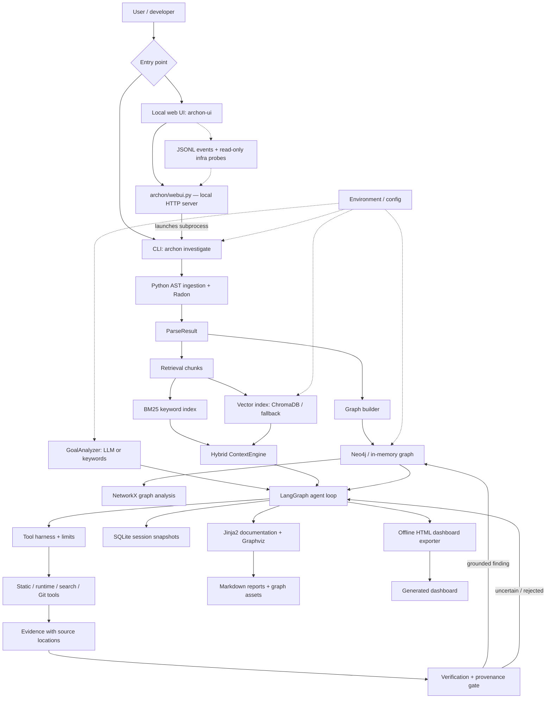

# Code-Archon — Architecture Guide

**Purpose:** explain the implementation that exists in this branch, how a run moves through the code, where results are stored, and which modules are optional or not yet wired into the main path.

> **Quick reading path:** start with the diagram, then read “Repository map” and “End-to-end execution”. The later synopsis comparison is retained as project-history/context; it is not a promise that every originally proposed feature is implemented.

## Current system at a glance

The standalone Mermaid source for this diagram lives at [docs/code-archon-architecture.mmd](docs/code-archon-architecture.mmd).



### The mental model

Code-Archon is a **Python repository investigation pipeline** wrapped by a CLI and a local browser UI. It parses the target repository first, then builds two complementary forms of context: a relationship graph and a searchable code index. A LangGraph state machine uses those contexts and bounded tools to investigate tasks. Findings are checked against evidence and source provenance before being promoted to the graph. Finally, the run is saved and rendered into documentation and an offline dashboard.

The browser UI is an adapter, not a second analysis engine: it validates launch options, starts the CLI as a subprocess, and presents run status/logs. Observability is designed to be best-effort and should not change investigation results.

## Repository map

| Path | Responsibility | How it participates |
|---|---|---|
| `archon/cli.py` | Main Typer CLI and orchestration | Owns the end-to-end `investigate` flow; also exposes the other CLI commands defined in the module |
| `archon/webui.py` | Local browser UI and HTTP handlers | Starts/monitors CLI subprocesses and exposes run/status/log/infrastructure endpoints |
| `archon/config.py` | Environment-backed settings | LLM, Neo4j, Redis, Chroma, agent limits and output/data paths |
| `archon/goal_analyzer.py` | Objective decomposition | Converts a plain-language goal into an `InvestigationGoal`; keyword fallback works without an LLM |
| `archon/llm.py` | LLM factory | Builds a LangChain chat model for configured providers; Groq is the default configuration, with provider-specific branches for Anthropic/OpenAI |
| `archon/repo_summary.py` | Compact factual repository summary | Grounds goal decomposition and search-term suggestions in the parsed source tree |
| `archon/ingestion/ast_parser.py` | Python source ingestion | Produces Pydantic `ParseResult`, `ModuleNode`, `ClassNode`, and `FunctionNode` records, with parse errors retained |
| `archon/ingestion/git_reader.py` | Git ingestion placeholder | Currently a stub; Git history helpers used by tools live in `archon/tools/git_tools.py` |
| `archon/graph/builder.py` | Graph construction | Resolves imports, calls, inheritance and containment from parsed symbols; ambiguous matches are intentionally skipped |
| `archon/graph/neo4j_client.py` | Graph persistence abstraction | Exposes node/edge models and a Neo4j store with an in-memory fallback |
| `archon/graph/network_graph.py` | In-process graph algorithms | Mirrors the store into NetworkX for entry-point, dead-code, cycle and call-chain queries |
| `archon/retrieval/bm25.py` | Lexical retrieval | BM25 ranking over source chunks |
| `archon/retrieval/vector_store.py` | Vector retrieval and context assembly | ChromaDB-backed index with fallback behavior; `ContextEngine` combines lexical/vector hits and builds bounded context |
| `archon/agent/loop.py` | Investigation state machine | LangGraph nodes implement planning, evidence gathering, observation, verification, graph update, unknown identification and bounded retries |
| `archon/agent/harness.py` | Tool execution policy | Enforces tool allowlists and per-tool call limits; records calls and emits observational events |
| `archon/agent/evidence.py` | Evidence collection | Combines retrieval, literal search and graph context into evidence items with `file:line` provenance |
| `archon/tools/static.py` | Static analysis tools | AST inspection, Radon complexity and optional Semgrep |
| `archon/tools/runtime.py` | Runtime checks | Pytest and coverage subprocess wrappers |
| `archon/tools/search.py` | Source search | ripgrep with a pure-Python fallback |
| `archon/tools/git_tools.py` | Git metadata | Commit log, blame and diff helpers through GitPython |
| `archon/verification/harness.py` | Evidence-based verdicts | Returns VERIFIED, REFUTED or UNCERTAIN plus supporting/contradicting evidence |
| `archon/verification/hallucination.py` | Provenance gate | Rejects promotion when evidence has no recognizable source-location reference |
| `archon/memory/sqlite_store.py` | Run/session persistence | Stores session metadata and serialized iteration snapshots in SQLite |
| `archon/memory/redis_store.py` | Cross-session summary storage | Redis-backed summary store and in-memory mock; available as a module, but not part of the main `investigate` path shown in the CLI |
| `archon/docs/generator.py` | Report generation | Renders reports/module docs and Graphviz artifacts from parse/graph data |
| `archon/docs/templates/` | Jinja2 templates | Templates for report and per-module documentation |
| `archon/ui_export.py` | Offline dashboard assembly | Embeds run data, artifacts and safe source snippets into generated HTML |
| `archon/ui/template.html` | Dashboard frontend template | HTML/CSS/JS for the generated dashboard and UI assets |
| `archon/ui/cytoscape.min.js` | Graph visualization dependency | Bundled client-side graph rendering library |
| `archon/observability/events.py` | Best-effort event sink | Writes JSONL events only when `ARCHON_EVENT_LOG` is configured; failures are swallowed |
| `archon/observability/infrastructure.py` | Read-only dependency probes | Best-effort checks for services/containers used by the live UI |
| `tests/` | Unit, extended and regression tests | Tests module behavior, evidence/provenance, UI export and regressions |
| `pyproject.toml` | Packaging and dependencies | Declares Python >=3.11, console scripts, optional dev dependencies and packaged UI/templates |
| `CODE_ARCHON_RECOMMENDATIONS.md` | Follow-up engineering notes | Separates already-implemented fixes from recommendations still needing review |

Some generated/package metadata (for example `code_archon.egg-info/SOURCES.txt`) can lag behind the working tree; use the actual package files and `pyproject.toml` as the source of truth.

## Entry points

- **CLI:** `archon investigate <repo> --goal "..." [--output ./output] [--max-iter 15]`
- **Browser UI:** `archon-ui` launches the local UI server; the UI invokes the CLI rather than duplicating its pipeline.
- **Python package:** modules can also be imported directly for tests and targeted programmatic use.

## End-to-end execution

1. **Validate input and prepare output.** The CLI checks the target repository path, creates the output directory and chooses a session ID.
2. **Parse the repository.** `parse_repository()` walks Python files and extracts modules, classes, functions, imports, call names, line ranges and complexity metadata. Syntax/IO problems are collected rather than treated as a complete stop.
3. **Build the knowledge graph.** `build_graph()` adds module/symbol nodes and relationships to the selected graph store. The CLI clears the store by default for a clean run; `--keep-graph` opts out. This matters when using a persistent Neo4j instance.
4. **Build retrieval indexes.** The parser output becomes chunks. BM25 supports keyword matching; the vector backend supports semantic-ish similarity. The `ContextEngine` fuses results and respects a context-size budget.
5. **Decompose the goal.** Explicit repeated `--task` values bypass decomposition. Otherwise `GoalAnalyzer` uses the configured LLM when available and falls back to keyword rules.
6. **Run the agent loop.** The LangGraph state machine selects a task, gathers evidence, forms/updates a hypothesis and chooses whether to continue, retry or mark work unresolved. Iteration and per-task retry limits prevent unbounded loops.
7. **Collect evidence through bounded tools.** The harness checks the allowlist and per-tool call budget. Evidence can come from hybrid retrieval, ripgrep and graph relationships; evidence records retain source locations.
8. **Verify before promotion.** Verdicts are VERIFIED, REFUTED or UNCERTAIN. The provenance gate prevents unsupported claims from being promoted to the knowledge graph. Unverified work is reported as unresolved/unknown rather than silently treated as false.
9. **Persist and generate outputs.** The CLI saves the final state in `output/session.db`, then the documentation generator creates reports and graph assets. The UI exporter produces an offline HTML dashboard that references evidence/source snippets and generated artifacts.
10. **Observe the run (optional).** If configured, the event sink writes JSONL trace events. The browser UI can present process logs and read-only infrastructure status; telemetry is best-effort and should not affect analysis behavior.

## Important boundaries and caveats

- **Python-first analysis:** the parser is designed around Python ASTs. It is not a language-agnostic parser despite the wider reverse-engineering goal.
- **Heuristic graph edges:** call/import/inheritance resolution is static and name-based. The builder skips ambiguous candidates rather than pretending to know the exact runtime target.
- **Retrieval is approximate:** the lexical/hash embedding fallback is deterministic and offline-friendly, but it is not equivalent to a trained semantic embedding model.
- **Graph persistence differs by environment:** Neo4j provides persistence; the in-memory store is useful for local tests/fallbacks but disappears with the process.
- **Optional services are optional:** Redis and external LLM services require configuration and may be unavailable; the primary CLI can fall back for goal decomposition and graph storage, but LLM verification behavior can be more limited without a model.
- **Runtime tools are subprocesses, not a security sandbox:** do not treat the harness as isolation for running untrusted target repositories.
- **UI observability is non-authoritative:** infrastructure probes and log/event status are diagnostic. They do not replace the result/evidence state saved by the investigation.
- **No test execution was performed as part of writing this architecture documentation.**

---

## Historical / specification comparison

The following sections preserve the earlier synopsis-to-implementation comparison. Treat the synopsis as the original design target; the current repository map and execution description above take precedence where implementation has evolved.

---

## 1. Synopsis Architecture (from PDF)

The synopsis described a layered architecture with the following components:

```
Legacy Repository
       │
  Goal Analyzer
       │
  Agent Loop (LangGraph / CrewAI)
  Plan → Act → Observe → Verify
       │
    Harness (rules, permissions, stop criteria)
       │
  Context Engine (BM25 + ChromaDB/pgvector)
       │
  ┌────────────┬──────────────┬─────────────────┐
  │  Static    │  Runtime+Git │  Filesystem+    │
  │  Analysis  │  (pytest,    │  Search         │
  │  (ast,     │  coverage,   │  (ripgrep,      │
  │  radon,    │  gitpython,  │  ctags, grep)   │
  │  semgrep,  │  Docker)     │                 │
  │  tree-sitter)             │                 │
  └────────────┴──────────────┴─────────────────┘
       │
  Context/Knowledge Graph (Neo4j + NetworkX)
  Nodes: Modules, Classes, Functions, APIs,
         Behaviors, Hypotheses, Evidence, Gaps
       │
  Memory Layer (SQLite + Redis + Embeddings)
       │
  Verification Harness
  (pytest re-run, static cross-check,
   hallucination filter — file:line provenance)
       │
  Documentation Generator
  (Jinja2, Sphinx, Graphviz, D3.js)
       │
  Output: Architecture map, dependency graph,
          annotated docs, detected bugs
```

**Specified LLMs:** GPT-4o or Claude 3.7 Sonnet
**Specified agent framework:** LangGraph or CrewAI
**Specified tool interface:** MCP (Model Context Protocol)

---

## 2. Current Implementation Architecture

```
Legacy Repository (.py files)
          │
          ▼
┌─────────────────────────────────────┐
│  archon/ingestion/ast_parser.py     │  ← Phase 1
│  parse_repository(repo_root)        │
│  → ModuleNode, ClassNode,           │
│    FunctionNode (Pydantic)          │
│  Tools: ast, radon, tomllib        │
└────────────────┬────────────────────┘
                 │
                 ▼
┌─────────────────────────────────────┐
│  archon/graph/                      │  ← Phase 2
│  ├── neo4j_client.py               │
│  │   make_graph_store()            │
│  │   _Neo4jStore  (production)     │
│  │   _InMemoryStore (fallback)     │
│  │   Labels: Module, Class,        │
│  │   Function, Hypothesis,Evidence │
│  │   Edges: IMPORTS, CALLS,        │
│  │   INHERITS, CONTAINS, SUPPORTS  │
│  │   Every node: confidence+provenance│
│  └── network_graph.py              │
│      ArchonGraph (NetworkX DiGraph)│
│      find_entry_points()           │
│      find_dead_code()              │
│      get_call_chain() [BFS]        │
│      has_cycle() / find_cycles()   │
└────────────────┬────────────────────┘
                 │
                 ▼
┌─────────────────────────────────────┐
│  archon/retrieval/                  │  ← Phase 3
│  ├── bm25.py  BM25Index            │
│  │   rank-bm25, keyword search     │
│  └── vector_store.py               │
│      VectorStore (ChromaDB)        │
│      _HashEmbeddingFunction (CI)   │
│      DefaultEmbeddingFunction (prod│
│      ContextEngine:                │
│        query() → hybrid BM25+vec  │
│        build_context_window()      │
│        chunks_from_parse_result()  │
└────────────────┬────────────────────┘
                 │
                 ▼
┌─────────────────────────────────────┐
│  archon/goal_analyzer.py            │  ← Phase 4
│  GoalAnalyzer                       │
│  ├── _keyword_analyze() (offline)  │
│  └── _llm_analyze() (Groq/LLM)    │
│  → InvestigationGoal               │
│    (objective, focus_modules,      │
│     investigation_tasks,           │
│     success_criteria)              │
└────────────────┬────────────────────┘
                 │
                 ▼
┌─────────────────────────────────────┐
│  archon/agent/                      │  ← Phase 4-5
│  ├── loop.py  LangGraph StateGraph │
│  │   Nodes: plan, act, observe,    │
│  │   verify, update_graph,         │
│  │   identify_unknowns,            │
│  │   investigate, complete         │
│  │   AgentState (Pydantic)         │
│  │   Hard stop in node_plan()      │
│  └── harness.py  Harness           │
│      ToolNotPermittedError         │
│      ToolCallLimitError            │
│      allowed_tools allowlist       │
│      call_limit_per_tool           │
│      recovery_strategy             │
│      Full call log                 │
└────────────────┬────────────────────┘
                 │
       ┌─────────┼─────────┐
       ▼         ▼         ▼
  archon/tools/
  ├── static.py            (ast, radon, semgrep)
  ├── runtime.py           (pytest, coverage.py)
  ├── search.py            (ripgrep → grep fallback)
  └── git_tools.py         (gitpython: log, blame, diff)
       │
       ▼
┌─────────────────────────────────────┐
│  archon/verification/               │  ← Phase 6
│  ├── harness.py                    │
│  │   verify_hypothesis()           │
│  │   VerificationStatus:           │
│  │   VERIFIED / REFUTED / UNCERTAIN│
│  │   Confidence: 0.5+0.15×n ≤0.95 │
│  └── hallucination.py              │
│      check_claim()                 │
│      regex: [\w/\\.-]+\.py:\d+    │
│      promote_to_graph()            │
│      — blocked if HALLUCINATED     │
└────────────────┬────────────────────┘
                 │
                 ▼
┌─────────────────────────────────────┐
│  archon/memory/                     │  ← Phase 7
│  ├── sqlite_store.py SQLiteStore   │
│  │   Tables: sessions,             │
│  │   iteration_log, evidence_cache │
│  └── redis_store.py RedisStore     │
│      Key: archon:repo:{hash}:summary│
│      TTL: 30 days                  │
│      _MockRedisStore (fallback)    │
└────────────────┬────────────────────┘
                 │
                 ▼
┌─────────────────────────────────────┐
│  archon/docs/generator.py           │  ← Phase 8
│  DocumentationGenerator            │
│  Outputs:                          │
│  ├── report.md  (Jinja2)           │
│  ├── modules/*.md (per-module)     │
│  ├── architecture.dot + .png       │
│  └── callgraph.dot + .png          │
└─────────────────────────────────────┘
          │
          ▼
   archon/cli.py
   archon investigate --repo ./path --goal "..."
```

---

## 3. Component-by-Component Comparison

### 3.1 Goal Analyzer

| Aspect | Synopsis Spec | Current Implementation |
|--------|--------------|----------------------|
| Input | Free-text objective | Free-text objective ✅ |
| Output | Investigation goal + tasks | `InvestigationGoal` Pydantic model ✅ |
| LLM-backed | GPT-4o / Claude 3.7 | Groq llama-3.3-70b-versatile ✅ (swappable) |
| Offline fallback | Not specified | Keyword-based `_keyword_analyze()` ✅ |

### 3.2 Agent Loop

| Aspect | Synopsis Spec | Current Implementation |
|--------|--------------|----------------------|
| Framework | LangGraph or CrewAI | LangGraph `StateGraph` ✅ |
| Cycle | Plan→Act→Observe→Verify | PLAN→ACT→OBSERVE→VERIFY→UPDATE_GRAPH→IDENTIFY_UNKNOWNS ✅ |
| LLM driver | GPT-4o / Claude 3.7 | Groq (via `make_llm()`) ✅ |
| Recovery | "Revise, retry, replan" | INVESTIGATE node → loops to PLAN ✅ |
| Hard stop | Not specified | `max_iterations` in `node_plan()` ✅ |
| State schema | Not specified | `AgentState` Pydantic model ✅ |

### 3.3 Harness

| Aspect | Synopsis Spec | Current Implementation |
|--------|--------------|----------------------|
| Tool permissions | Allowlist per goal type | `HarnessConfig.allowed_tools` set ✅ |
| Call limits | Per-tool max calls | `call_limit_per_tool` enforced ✅ |
| Require evidence | Before promoting claims | `require_evidence_before_promote` flag ✅ |
| Recovery strategies | Not detailed | REPLAN / RETRY / SKIP configurable ✅ |
| Logging | Not specified | Full `ToolCall` log per session ✅ |

### 3.4 Context Engine

| Aspect | Synopsis Spec | Current Implementation |
|--------|--------------|----------------------|
| BM25 | `rank-bm25` | `BM25Index` using `rank-bm25` ✅ |
| Vector store | ChromaDB or pgvector | ChromaDB ✅ |
| Embeddings | sentence-transformers or OpenAI | Hash embed (CI) / MiniLM (prod) ✅ |
| Sliding window | Specified | `build_context_window()` token budget ✅ |

### 3.5 Context / Knowledge Graph

| Aspect | Synopsis Spec | Current Implementation |
|--------|--------------|----------------------|
| Graph DB | Neo4j (AuraDB / Community) | Neo4j + `_InMemoryStore` fallback ✅ |
| Query language | Cypher | Cypher in `_Neo4jStore` ✅ |
| In-process | NetworkX | `ArchonGraph` (NetworkX DiGraph) ✅ |
| Node types | modules, classes, functions, APIs, behaviors, hypotheses, evidence | Module, Class, Function, Hypothesis, Evidence ✅ (APIs, behaviors deferred to Phase 9+) |
| Edge types | imports, calls, inheritance, data flow, evidence-to-claim | IMPORTS, CALLS, INHERITS, CONTAINS, SUPPORTS ✅ |
| Confidence scores | Per node | `confidence: float` on every node ✅ |
| Provenance | File:line per node | `provenance: str` on every node ✅ |
| Cycle detection | Not explicitly specified | `has_cycle()`, `find_cycles()` ✅ |

### 3.6 Tool Layer

| Tool | Synopsis Spec | Current Implementation |
|------|--------------|----------------------|
| AST analysis | `ast`, `jedi`, `rope` | `ast` (full), `jedi` (stub) ✅ |
| Complexity | `radon`, `pylint`, `mypy` | `radon` ✅ (pylint/mypy deferred) |
| Security | `semgrep`, `tree-sitter` | `semgrep` (subprocess) ✅ |
| Tests | `pytest`, `coverage.py`, `hypothesis` | `pytest` + `coverage.py` ✅ |
| Git | `gitpython`, `PyGit2` | `gitpython` ✅ |
| Search | `ripgrep`, `ctags` | `ripgrep` (+ grep fallback) ✅, `ctags` ✅ |
| Docker sandbox | Specified | Not yet implemented ⚠️ |
| MCP interface | Specified | Not yet implemented ⚠️ |

### 3.7 Verification Harness

| Aspect | Synopsis Spec | Current Implementation |
|--------|--------------|----------------------|
| pytest re-run | Specified | `run_pytest()` available ✅ |
| Static cross-check | Specified | Radon + semgrep cross-check ✅ |
| Hallucination filter | Claims must trace to file:line | `check_claim()` + `promote_to_graph()` ✅ |
| Confidence promotion | Not detailed | `confidence = min(0.5 + 0.15×n, 0.95)` ✅ |

### 3.8 Memory Layer

| Aspect | Synopsis Spec | Current Implementation |
|--------|--------------|----------------------|
| Session memory | SQLite | `SQLiteStore` (3-table schema) ✅ |
| Cross-session | Redis | `RedisStore` + `_MockRedisStore` fallback ✅ |
| Embedding cache | Specified | Deferred (ChromaDB acts as cache) ⚠️ |

### 3.9 Documentation Generator

| Aspect | Synopsis Spec | Current Implementation |
|--------|--------------|----------------------|
| Templates | Jinja2 | Jinja2 `.j2` templates ✅ |
| API docs | Sphinx | Deferred ⚠️ |
| Diagrams | Graphviz, D3.js | Graphviz `.dot` → `.png` ✅, D3.js deferred ⚠️ |
| Reports | Markdown / HTML | Markdown ✅, HTML deferred ⚠️ |

### 3.10 LLM Provider

| Aspect | Synopsis Spec | Current Implementation |
|--------|--------------|----------------------|
| Primary LLM | GPT-4o or Claude 3.7 Sonnet | Groq llama-3.3-70b-versatile ✅ |
| Rationale | Paid API, high capability | Free tier, fast, sufficient for structured tasks |
| Fallback | Not specified | Keyword-only mode (no LLM needed) ✅ |
| Swappable | Not specified | `make_llm()` factory supports Groq/Anthropic/OpenAI ✅ |

---

## 4. What Is Deferred / Not Yet Implemented

These items are in the synopsis spec but not yet in the current implementation:

| Feature | Reason |
|---------|--------|
| Docker sandbox for runtime tool execution | Adds complexity; subprocess isolation used instead |
| MCP (Model Context Protocol) tool interface | Would replace current tool layer in Phase 10+ |
| Sphinx API documentation | Phase 10 deliverable |
| D3.js interactive dependency graph | Frontend phase, post-core |
| `jedi`, `rope`, `pylint`, `mypy` deep integration | Radon + semgrep cover core analysis |
| `hypothesis` (fuzz testing) | Runtime phase, post-core |
| `pgvector` as vector store | ChromaDB sufficient; pgvector for scaling |
| `PyGit2` | gitpython covers all needed operations |
| Embedding cache (separate from vector store) | ChromaDB upsert acts as cache |
| CrewAI multi-agent option | LangGraph selected as primary |

---

## 5. Data Flow — End to End

```
User: archon investigate --repo ./legacy --goal "understand auth"

1. CLI parses args
2. ast_parser.parse_repository(./legacy)
   → [ModuleNode, ClassNode, FunctionNode, ...]

3. GraphStore.upsert_node() for each node
   → Neo4j (or _InMemoryStore)
   → ArchonGraph.sync_from_store()

4. BM25Index.build(chunks)
   VectorStore.add_chunks(chunks)

5. GoalAnalyzer.analyze("understand auth")
   → InvestigationGoal(tasks=[...])

6. build_agent_graph(llm, harness, store)
   graph.invoke(AgentState(goal=...).model_dump())

   Loop (up to max_iterations):
     PLAN:           form hypothesis
     ACT:            harness.execute_default_tool()
     OBSERVE:        collect evidence
     VERIFY:         llm.invoke() or heuristic
       → VERIFIED:   update_graph → identify_unknowns
       → UNCERTAIN:  investigate → replan
     IDENTIFY_UNKNOWNS: store.low_confidence_nodes()
     COMPLETE:       break

7. SQLiteStore.save_iteration(session_id, final_state)

8. DocumentationGenerator.generate(session_id, ./output)
   → output/report.md
   → output/modules/auth.py.md
   → output/architecture.dot/.png
   → output/callgraph.dot/.png
```

---

## 6. Key Architectural Decisions

### In-Memory Fallbacks Everywhere
Every external service has a same-interface in-memory fallback:
- Neo4j → `_InMemoryStore`
- Redis → `_MockRedisStore`
- MiniLM embeddings → `_HashEmbeddingFunction`

This means the entire stack runs without any Docker or external services, which is critical for CI and development.

### Hallucination Filter as Hard Gate
The hallucination filter (`promote_to_graph()`) is a hard write gate — no claim can enter the knowledge graph without a `file.py:line` provenance reference. This is the core academic contribution: provenance-enforced knowledge.

### LangGraph Dict Wrapping
LangGraph's `StateGraph(dict)` requires plain dicts. Pydantic `AgentState` models are wrapped/unwrapped at every node boundary:
```python
def wrap(fn):
    def _wrapped(state_dict):
        s = AgentState(**state_dict)
        return fn(s).model_dump()
    return _wrapped
```
This keeps node functions type-safe internally while satisfying LangGraph's dict contract.

### UUID-per-VectorStore Collection
ChromaDB `EphemeralClient` is a process-level singleton. Every `VectorStore` instance gets a unique collection name to prevent cross-instance data contamination in tests.
