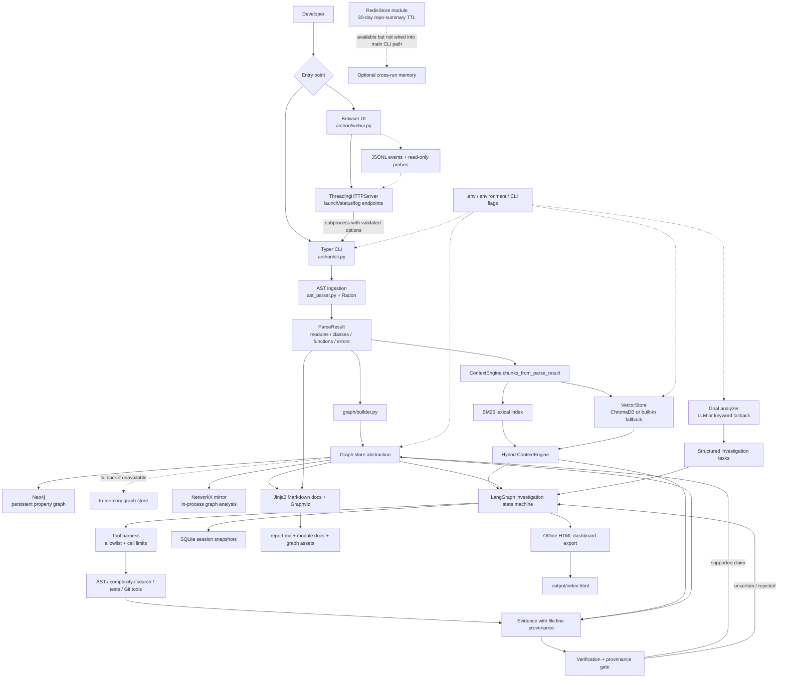
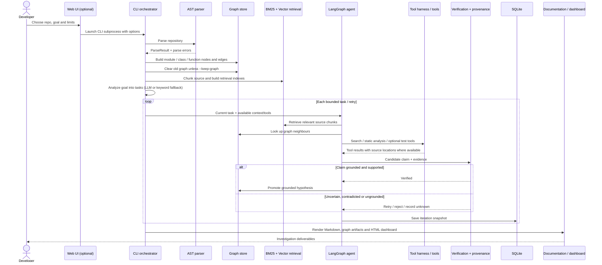

# Code-Archon — Component Architecture

> A code-level map of the current implementation on `feature/dev-dashboard-control-center`. This describes what the repository wires together today, not an aspirational design. In particular, Redis support exists as a module, but is **not called by the main `archon investigate` path**.

## 1. System architecture

### The key architectural idea

Code-Archon constructs **two complementary representations** of a repository:

1. **Relationship graph** — entities and edges explain which modules import, contain, inherit from, or call other entities.
2. **Searchable code index** — BM25 and vector retrieval find source chunks relevant to the current task.

The agent uses both, plus bounded tools and evidence provenance, to investigate. The graph is not the LLM; retrieval is not verification; and the browser UI is not a second analysis engine.

## 2. End-to-end execution sequence

**Operational nuance:** when the web UI is used, it validates launch settings and runs the existing CLI as a subprocess. The core parsing, indexing and investigation pipeline remains in the CLI. The web process tracks status and logs; it does not duplicate the analysis.

## 3. Components and responsibilities

| Component | Main code | Responsibility | Important boundary |
|---|---|---|---|
| CLI/orchestrator | `archon/cli.py` | Orders parsing, graph construction, indexing, goal decomposition, agent run and exports | Owns the end-to-end investigation lifecycle |
| Web UI / API | `archon/webui.py`, `archon/ui/*` | Launches and monitors CLI subprocesses; exposes run state, logs and diagnostics | UI is a launcher/observer, not the analysis engine |
| Configuration | `archon/config.py`, environment, CLI flags | Supplies model, database, retrieval and run-limit settings | Secrets belong in environment configuration, not saved browser profiles |
| AST ingestion | `archon/ingestion/ast_parser.py` | Extracts Python modules, classes, functions, imports, calls and parse errors | Static extraction; does not execute the target application |
| Goal analysis | `archon/goal_analyzer.py`, `archon/repo_summary.py` | Turns a broad objective into tasks and success criteria; keyword fallback is available | LLM-generated task plans still need source evidence |
| Graph construction | `archon/graph/builder.py` | Resolves import/call/inheritance/containment relationships | Call and inheritance resolution is name-based and heuristic; ambiguous links are skipped |
| Graph persistence | `archon/graph/neo4j_client.py` | Provides node/edge store interface backed by Neo4j or in-memory fallback | In-memory fallback is not persistent or browsable after process exit |
| Graph algorithms | `archon/graph/network_graph.py` | Mirrors stored graph into NetworkX for entry points, call chains, cycles and dead-code queries | NetworkX is an in-process analysis mirror, not the persistent database |
| Keyword retrieval | `archon/retrieval/bm25.py` | Ranks chunks by lexical relevance | Strong for exact identifiers and terminology |
| Vector retrieval/context | `archon/retrieval/vector_store.py` | Vector search plus context assembly and token-budget bounding | ChromaDB can fall back to a built-in in-memory index; CLI currently asks for deterministic hash embeddings |
| Evidence gathering | `archon/agent/evidence.py` | Combines hybrid retrieval, literal search and graph neighbours | Evidence items carry source paths/line references where available |
| Agent state machine | `archon/agent/loop.py` | Plans tasks, gathers evidence, observes, verifies, updates graph, tracks unknowns and retries | Iterations and retries are bounded to avoid endless loops |
| Tool policy | `archon/agent/harness.py` | Enforces tool allowlists/call limits and records tool calls | A tool must be allowed and within its configured call budget |
| Verification | `archon/verification/harness.py`, `hallucination.py` | Classifies support/contradiction/uncertainty and gates graph promotion on provenance | A citation-like path alone is not a guarantee that every interpretation is correct |
| Session history | `archon/memory/sqlite_store.py` | Stores session metadata, iteration snapshots and evidence-cache records | Separate from repository graph storage |
| Cross-session summary store | `archon/memory/redis_store.py` | Can save/load a JSON repository summary with a 30-day TTL; has an in-memory mock fallback | Module exists, but the main CLI path does not currently invoke it |
| Documentation | `archon/docs/generator.py`, templates | Renders `report.md`, per-module documentation and graph assets | Documentation is generated from parse results and graph findings |
| HTML dashboard export | CLI export code | Creates the offline `output/index.html` report/dashboard | This is a generated investigation artifact, distinct from the live launcher UI |
| Observability | `archon/observability/*` | Emits structured JSONL events; UI can read events and perform read-only infrastructure probes | Observability should not be treated as the source of truth for investigation findings |

## 4. Storage and infrastructure: what each service actually does

### Neo4j — persistent relationship graph

Neo4j stores the graph using labeled nodes and typed relationships. Current graph entities include modules, classes, functions, and promoted hypotheses; relationships include `IMPORTS`, `CALLS`, `INHERITS`, `CONTAINS`, and evidence-support relationships where used.

**Why it matters:** a text search can find a function, but a graph can help trace callers, imports, inheritance and surrounding structure. The graph builder uses static/name-based resolution, so these edges are useful maps—not a guarantee of perfect runtime call resolution.

The CLI calls `make_graph_store(wait=45)`: if Neo4j is reachable it uses the Neo4j-backed store; otherwise it falls back to an in-memory store. Unless `--keep-graph` is set, the current graph is cleared before building a new repository graph. This prevents separate runs from being mixed, but also means the default is not a multi-repository graph.

Docker Compose exposes:
- `7474`: Neo4j browser / HTTP interface
- `7687`: Bolt protocol used by the driver

The Compose file includes a named `neo4j_data` volume, so Neo4j data persists across container restarts even though the CLI clears the graph at the start of a normal run.

### Redis — optional repository-summary memory

Redis is **not the graph database** and does not store the per-iteration run snapshots in this implementation. The module `archon/memory/redis_store.py` exposes `save_repo_summary`, `load_repo_summary`, `ttl`, and `delete`. It stores one JSON summary per repository hash under a key shaped like `archon:repo:<hash>:summary`, with a 30-day TTL. If Redis is unavailable, `make_redis_store` returns a small in-memory mock.

Important current-state caveat: although Redis is listed as a dependency and started by Docker Compose, **the main `archon investigate` flow does not currently call this store**. Starting the Redis container alone therefore does not make cross-session memory active. Integration would require explicitly loading/saving repository summaries from the CLI/agent flow.

Compose starts Redis with persistence disabled (`--save "" --appendonly no`), appropriate for a disposable cache but not durable storage. Data in that container is lost when the Redis process restarts.

### SQLite — investigation/session snapshots

`archon/memory/sqlite_store.py` is the run-history store. Its schema includes:
- `investigation_sessions`: session ID and goal
- `iteration_log`: serialized JSON state snapshot for each iteration
- `evidence_cache`: source-linked evidence records

SQLite is conceptually different from Redis: it records the investigation's progress/history, while Redis is intended for reusable repository-level summaries across runs. The actual database path and persistence depend on how the CLI configures the store for the run.

### BM25, vector index and ContextEngine

These are search/indexing components, not general-purpose databases for agent state.

- **BM25:** lexical ranking, useful for exact function names, symbols and error strings.
- **VectorStore:** similarity search over indexed source chunks. ChromaDB is the preferred backend when it initializes; a built-in Python cosine-similarity fallback keeps retrieval available if Chroma's native engine fails.
- **Hash embeddings:** the current CLI constructs `VectorStore(use_hash_embed=True)`; this is deterministic feature hashing, not a transformer embedding model. It can capture token overlap, but should not be described as deep semantic understanding.
- **ContextEngine:** combines retrieval results and clips the returned context to the configured approximate token budget. It passes selected chunks to evidence gathering and the agent.

## 5. The agent loop and evidence controls

The LangGraph state machine uses explicit phases such as `PLAN`, `ACT`, `OBSERVE`, `VERIFY`, `UPDATE_GRAPH`, `IDENTIFY_UNKNOWNS`, and `COMPLETE`.

For each task, it can:
1. Retrieve code context through BM25/vector search.
2. Search literal keywords in repository files.
3. Inspect graph neighbours of promising hits.
4. Invoke allowed tools, such as AST analysis, complexity analysis, tests/coverage or Git metadata tools, when configured for that run.
5. Form a hypothesis and compare it against evidence.
6. Promote a grounded finding, or retry/reject it and eventually record an unresolved task.

Evidence items are capped, and only a bounded, balanced subset is placed into the LLM prompt so retrieval does not crowd out keyword and graph evidence. Limits such as retrieval top-k, context token budget, per-tool call limit, evidence collection limit and prompt evidence limit are configurable through CLI/environment settings.

The provenance gate looks for source-location references such as `path/to/file.py:42` before a claim can be promoted. This is a guardrail against unsupported claims, not a formal proof system: users should still inspect citations and the underlying source when correctness is critical.

## 6. Run outputs and observability

Typical investigation output is written under the selected output directory:
- `archon-diagnostics.json`: parser/graph/index diagnostics for the developer inspector
- `report.md`: generated investigation report
- `modules/`: per-module documentation
- graph image/source artifacts when Graphviz is available
- `index.html`: offline HTML dashboard

The live web UI is separate from these files:
- `/` or `/app`: customer-facing page
- `/dev`: developer launch/control dashboard
- `/live`: live observability view

The web server tracks subprocess status/logs and can surface run diagnostics. JSONL events are observational telemetry; they should not be confused with the graph, evidence set, or persisted session snapshots.

## 7. Important implementation caveats

- The supported target parser is Python AST-based; this is not a general multi-language parser.
- Static call/inheritance edges are heuristic and can miss dynamic dispatch, reflection, monkey-patching or runtime-generated calls.
- Neo4j can be replaced by an in-memory graph when unavailable; that run will not have persistent/browsable graph storage.
- The current vector path uses hash embeddings in the CLI, so vector retrieval is lightweight and deterministic rather than model-based semantic embedding.
- Redis summary persistence is implemented as a module but is not yet wired into the main investigation path.
- Verification and provenance checks reduce unsupported claims but do not mathematically prove them.
- The generated offline dashboard (`output/index.html`) and live developer UI (`/dev`) are different surfaces.

## 8. Useful starting points in the source

- `archon/cli.py` — end-to-end orchestration
- `archon/ingestion/ast_parser.py` — source parsing
- `archon/graph/builder.py` and `archon/graph/neo4j_client.py` — relationship graph
- `archon/graph/network_graph.py` — graph algorithms
- `archon/retrieval/bm25.py` and `archon/retrieval/vector_store.py` — search and context assembly
- `archon/agent/loop.py`, `harness.py`, `evidence.py` — agent execution and tool policy
- `archon/verification/*` — verification/provenance
- `archon/memory/sqlite_store.py` and `redis_store.py` — distinct memory/storage roles
- `archon/docs/generator.py` — Markdown/report generation
- `archon/webui.py` — local browser interface and subprocess monitoring
